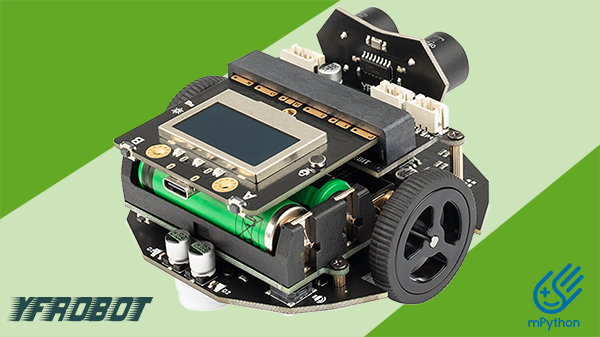
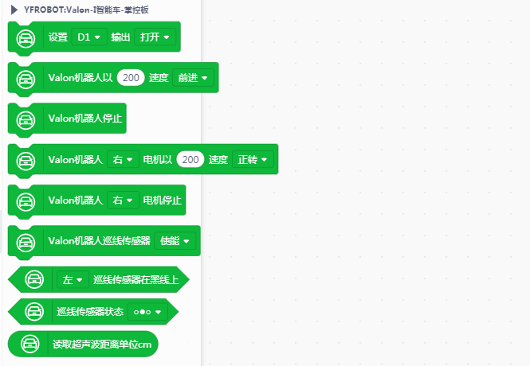
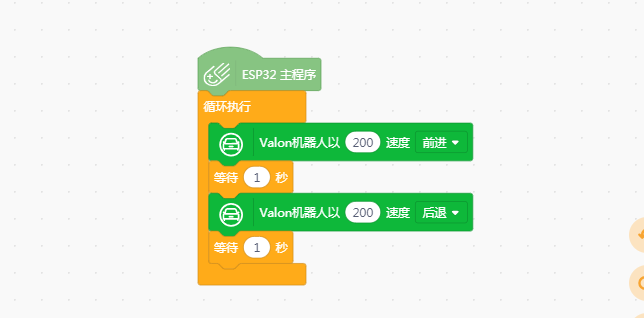

# YFROBOT VALON-I（掌控板）

---------------------------------------------------------

## 简介 Introduction

本扩展库为Mind+软件设计。

支持YFROBOT Valon-I 智能编程小车（掌控板）。

## 相关链接 Links
* 本项目加载链接: https://github.com/YFROBOT-TM

* 产品购买链接: [YFROBOT商城](https://www.yfrobot.com/)、[YFROBOT淘宝商城](https://yfrobot.taobao.com/).

## 积木列表 Blocks

## 示例程序 Examples

## 许可证 License
MIT

## 硬件支持列表 Hardware Support

请注意，不同主板，小车硬件不同。

主板型号                | 实时模式    | ArduinoC   | MicroPython    | 备注
------------------ | :----------: | :----------: | :---------: | -----
mpython掌控板        |             |        √已测试      |             | 

## 更新日志 Release Note
* V0.0.1  基础功能完成，Mind+V1.7.1 RC2.0版本软件测试

## 联系我们 Contact Us
* http://www.yfrobot.com.cn/wiki/index.php?title=%E8%81%94%E7%B3%BB%E6%88%91%E4%BB%AC

## 其他扩展库 Other extension libraries
* http://yfrobot.com.cn/wiki/index.php?title=YFRobot%E5%BA%93_For_Mind%2B

## 参考 Reference Resources